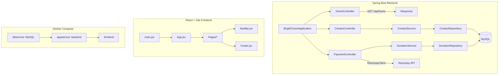

# BrightFuture Application Documentation

## Overview

BrightFuture is a full-stack NGO website comprising a Spring Boot backend and a React + Vite frontend.  
- The **backend** handles contact messages, donation orders via Razorpay, persistence in MySQL, and email notifications.  
- The **frontend** offers informational pages, a donation form, and a contact form.  
Both parts are containerized and orchestrated via Docker Compose for local development and production.

## Architecture Overview

## Backend Component Structure

### 1. Build & Wrapper

#### `.mvn/wrapper/maven-wrapper.properties`  
Defines the Maven distribution URL and checksum used by the Maven Wrapper .

#### `mvnw`  
Shell script that bootstraps a Maven distribution based on the wrapper properties .

#### `Dockerfile`  
Multi-stage build:
- **Stage 1**: Uses Maven + JDK 17 to compile and package the application.  
- **Stage 2**: Uses JDK 17 runtime image, copies the JAR and `run.sh`, exposes port 8080, and sets the entrypoint to `run.sh` .

#### `run.sh`  
Runs the Spring Boot JAR with JVM options, ensuring the container stays alive on failures .

### 2. Application Entry

#### `BrightFutureApplication.java`  
Main class annotated `@SpringBootApplication`; launches the Spring context .

### 3. Presentation Layer (Controllers)

| Controller         | Path                | Responsibility                                       |
|--------------------|---------------------|------------------------------------------------------|
| `HomeController`   | GET /api/home       | Returns a welcome string          |
| `ContactController`| POST /api/contact   | Accepts contact JSON, delegates to `ContactService`  |
| `PaymentController`| POST /api/payment/create-order POST /api/payment/verify | Creates Razorpay order and verifies payment via `DonationService`  |

### 4. Business Layer (Services)

| Service           | Methods                                          | Description                                                     |
|-------------------|--------------------------------------------------|-----------------------------------------------------------------|
| `ContactService`  | `saveContact(Contact)`                           | Persists `Contact`, sends notification email to admin  |
| `DonationService` | `saveDonationAndSendMail(DonationRequest)`       | Maps DTO to `Donation`, saves it, and emails donation details  |

### 5. Data Access Layer (Repositories)

| Repository           | Entity        | Description                                     |
|----------------------|---------------|-------------------------------------------------|
| `ContactRepository`  | `Contact`     | JPA repository for contact messages  |
| `DonationRepository` | `Donation`    | JPA repository for donation records  |

### 6. DTOs & Models

| Class              | Package               | Key Fields                                                                 |
|--------------------|-----------------------|-----------------------------------------------------------------------------|
| `DonationRequest`  | `com.brightfuture.dto`| `name`, `email`, `phone`, `address`, `amount`, `razorpayPaymentId`, `razorpayOrderId`, `razorpaySignature`  |
| `Contact`          | `com.brightfuture.model`| `id`, `name`, `email`, `phone`, `message`              |
| `Donation`         | `com.brightfuture.model`| `id`, `name`, `email`, `phone`, `address`, `amount`, `razorpayPaymentId`, `razorpayOrderId`  |

### 7. Configuration & Dependencies

#### `pom.xml`  
Defines Spring Boot parent, JPA, WebMVC, Razorpay SDK, mail, Lombok, dotenv plugin, MySQL connector, and test dependencies .

### 8. Testing

#### `BrightFutureApplicationTests.java`  
Sanity check that the Spring context loads successfully .

## Frontend Component Structure

### 1. Project Configuration

- **`package.json`**  
  Lists dependencies (`react`, `axios`, `react-router-dom`, etc.) and scripts (`dev`, `build`, `lint`) .
- **`vite.config.js`**  
  Standard Vite setup with React plugin.
- **`index.html`**  
  Root HTML loading `main.jsx` and the Razorpay checkout script .
- **`eslint.config.js`**  
  Enables recommended ESLint rules, React hooks, and React Refresh .
- **`Dockerfile`**  
  Node Alpine for a development container running `npm run dev` on port 5173 .
- **`README.md`**  
  Guidance on React + Vite, plugins, and ESLint .

### 2. Entry Point & Routing

#### `main.jsx`  
Bootstraps `<App />` into the DOM.

#### `App.jsx`  
Configures `react-router-dom` routes mapping URL paths to page components (e.g. `/donate` → `Donate.jsx`) .

### 3. Layout Components

- **`NavBar.jsx`**  
  Defines the top navigation menu and dropdowns for site sections; used by every page.
- **`Footer.jsx`**  
  Displays NGO details, social links, site links, and values.

### 4. Page Components

All pages import `NavBar` and `Footer` and correspond to routes:

| Page Component        | Route                        | Purpose                                                             |
|-----------------------|------------------------------|---------------------------------------------------------------------|
| `HomePage.jsx`        | `/`                          | Hero banner, programmes overview                 |
| `FoundersStory.jsx`   | `/founders-story`            | Founder’s journey with styled hero and story card  |
| `OurTeam.jsx`         | `/our-team`                  | Team member profiles layout                    |
| `OurSupporter.jsx`    | `/our-supporters`            | Donor, volunteer, and employer logos display      |
| `Mission.jsx`         | `/mission`                   | Vision, Mission & Values cards                 |
| `Advisory.jsx`        | `/advisory`                  | Advisory board grid layout                    |
| `Report.jsx`          | `/report`                    | Financial, foreign contribution, and certificate PDFs  |
| `Publications.jsx`    | `/publication`               | Monthly newsletter cards with download links      |
| `LivehoodProgramme.jsx`| `/livehood-programme`       | Programme overview with hero and objectives list                   |
| `BulandiProgramme.jsx`| `/bulandi`                   | Bulandi programme details                                             |
| `BadiSochProgramme.jsx`| `/badi-soch`                | Badi Soch programme details                                          |
| `OutreachMissions.jsx`| `/outreach-missions`         | Grid of outreach mission cards                                       |
| `StoriesOfChange.jsx` | `/stories-of-change`         | Scrollable story cards with hover interactions                       |
| `AnnualReports.jsx`   | `/annual-reports`            | Downloadable annual report PDFs                  |
| `Volunteer.jsx`       | `/volunteer`                 | Volunteer form / career, linking externally                          |
| `Career.jsx`          | `/career`                    | Careers page linking to external embed jobs                          |
| `ContactUs.jsx`       | `/contact`                   | Contact form posting to `/api/contact`          |
| `Donate.jsx`          | `/donate`                    | Donation form that calls `/api/payment/create-order` and `/api/payment/verify`  |

## Relationships & Data Flows

- **Contact Flow**:  
  `ContactUs.jsx` → fetch POST `/api/contact` → `ContactController.saveContact()` → `ContactService.saveContact()` → DB & email .
- **Donation Flow**:  
  `Donate.jsx` → axios POST `/api/payment/create-order` → `PaymentController.createOrder()` → Razorpay order → `Donate.jsx` opens checkout → on callback → axios POST `/api/payment/verify` → `PaymentController.verifyPayment()` → `DonationService.saveDonationAndSendMail()` → DB & email .

## Docker Compose Configuration

The top-level `docker-compose.yml` defines three services:

- **dbservice**: MySQL with healthcheck and volume.  
- **appservice**: Builds the backend, injects `.env`, depends on `dbservice`, exposes port 8080.  
- **frontend**: Builds from `./frontend`, runs `npm run dev`, exposes port 5173. 

This setup ensures both frontend and backend run together with a shared MySQL database.

---

This documentation covers the specified files and their interrelations, illustrating how controllers, services, repositories, React components, and Docker Compose orchestrate the BrightFuture application.
